# Potato Leaf Disease Classification Using Deep Learning

---

## ÖZYEĞİN UNIVERSITY

**Faculty of Industrial Engineering**
**Department of Data Science**
**CS 566** – Senior Project Report
**Fall 2024–2025**

### Project Title:

**Potato Leaf Disease Classification Using Deep Learning Models**

**By:** Demba Sow
**Supervised By:** Prof. Dr. Hasan Fehmi Ateş
**Email:** [dastech1998@gmail.com](mailto:dastech1998@gmail.com)

---

## Abstract

Potato crops are crucial for global food security, making disease detection essential. This study focuses on classifying potato leaf diseases using CNN, MobileNetV2, ResNet50, and DenseNet121. Experiments were conducted on the PLD dataset, and models were evaluated using accuracy, loss, precision, recall, and F1-score.

---

## 1. Introduction

Potatoes are a global food staple. Early detection of diseases like early blight, late blight, and healthy leaf identification improves yields and prevents economic losses. Traditional methods are error-prone; deep learning offers automated, scalable alternatives.

### Objectives

* Apply deep learning models for disease classification.
* Compare model performance and apply fine-tuning.
* Recommend the most effective model based on evaluation metrics.

---

## 2. Methodology

### 2.1 Dataset Description

* **Source**: Central Punjab, Pakistan
* **Total Images**: 4,072 (256x256 resolution)
* **Classes**:

  * Early Blight
  * Late Blight
  * Healthy

#### Class Examples

* Early Blight:
  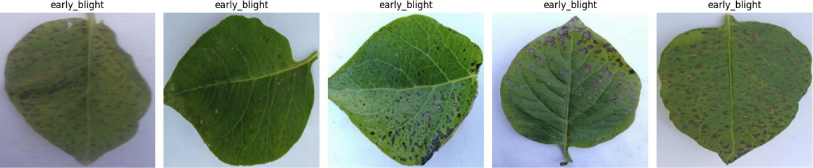
* Late Blight:
  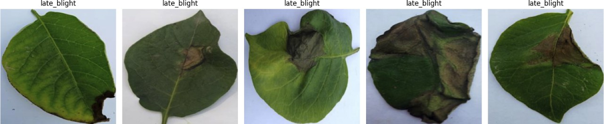
* Healthy:
  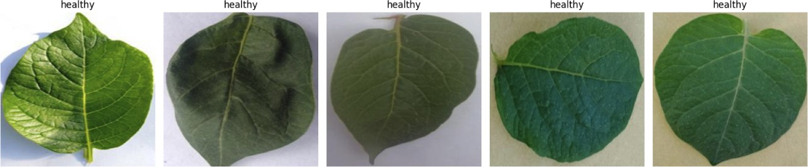

#### Dataset Structure

| Subset     | Early Blight | Late Blight | Healthy  | Total    |
| ---------- | ------------ | ----------- | -------- | -------- |
| Training   | 1303         | 1132        | 816      | 3251     |
| Validation | 163          | 151         | 102      | 416      |
| Testing    | 162          | 141         | 102      | 405      |
| **Total**  | **1628**     | **1424**    | **1020** | **4072** |

### 2.2 Data Preprocessing

* Resized to 224x224
* Normalized to \[0, 1] range
* Applied augmentation: rotation, zoom, flip, brightness
* Checked for corrupted images: none found

---

## 3. Deep Learning Models

### 3.1 Custom CNN I

* 8 layers total
* Conv2D, MaxPooling, Flatten, Dropout, Dense
* Output: 3-class softmax

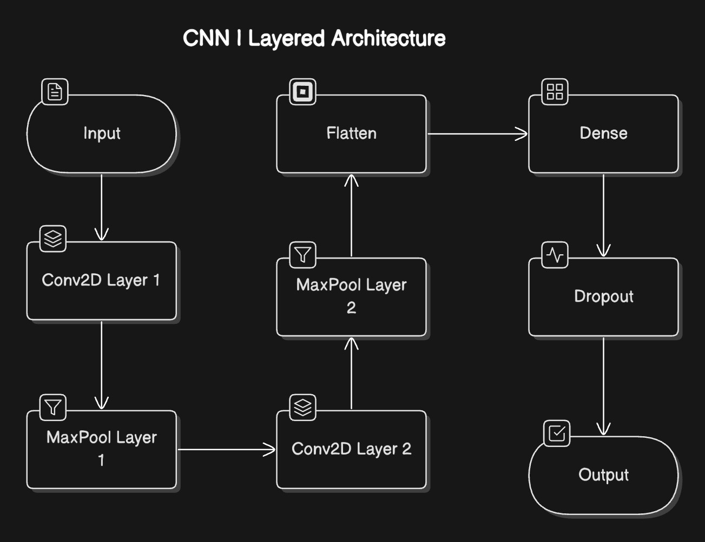
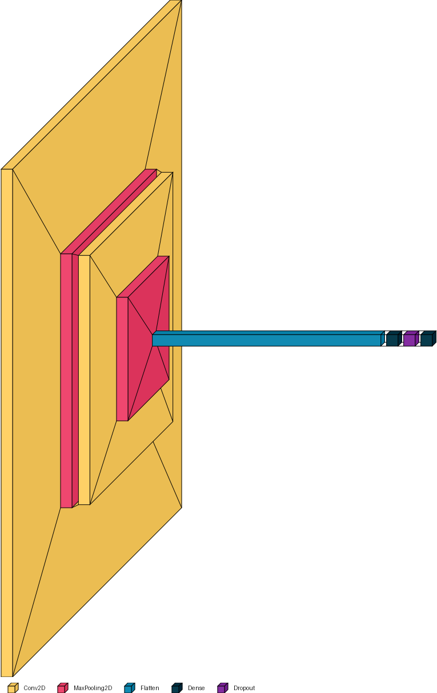

### 3.2 Custom CNN II

* 17 layers
* 6 Conv2D, 6 MaxPooling, Flatten, Dropout, Dense
* Output: 3 neurons

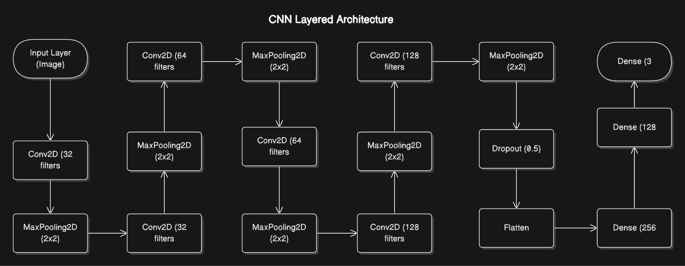
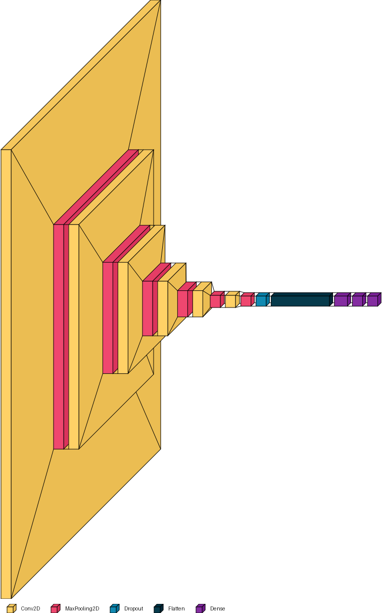

### 3.3 MobileNetV2

* Efficient, low-latency, mobile-optimized
* Uses depthwise separable convolutions

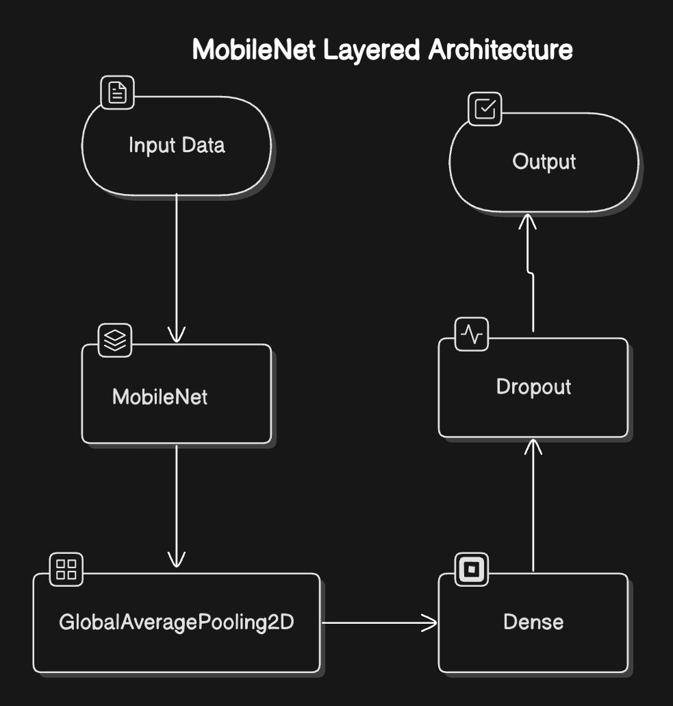
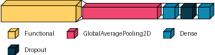

### 3.4 ResNet50

* 50-layer residual network
* Known for skip connections

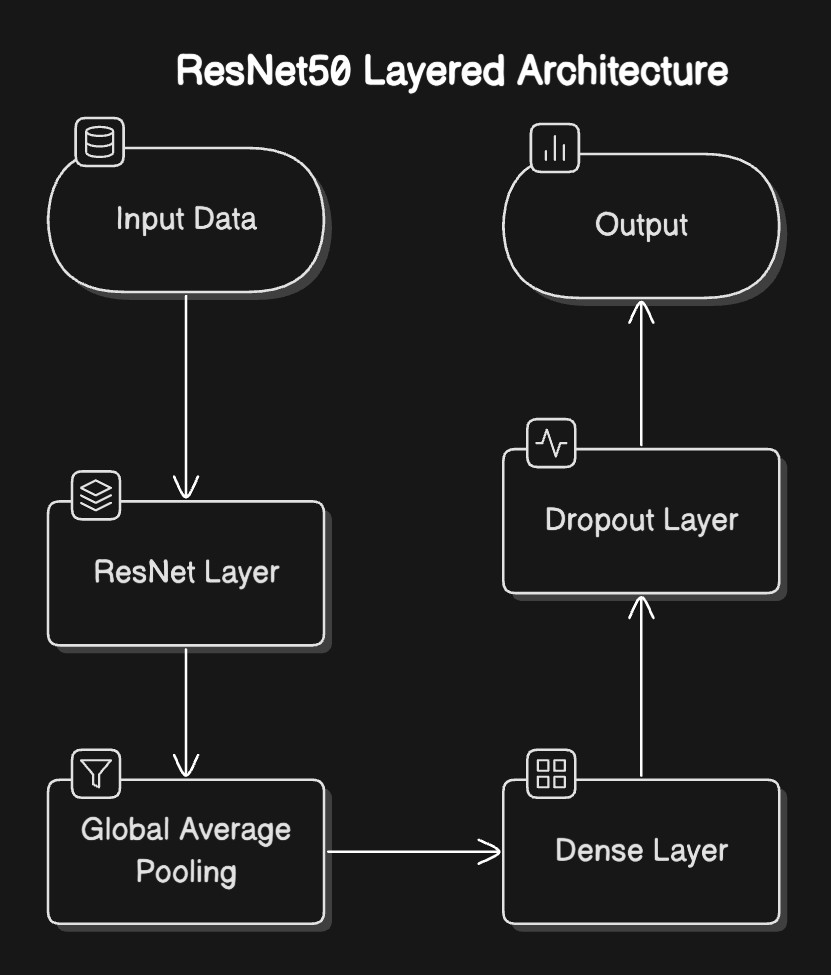
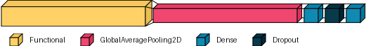

### 3.5 DenseNet121

* Dense connectivity across layers
* High feature reuse and gradient flow

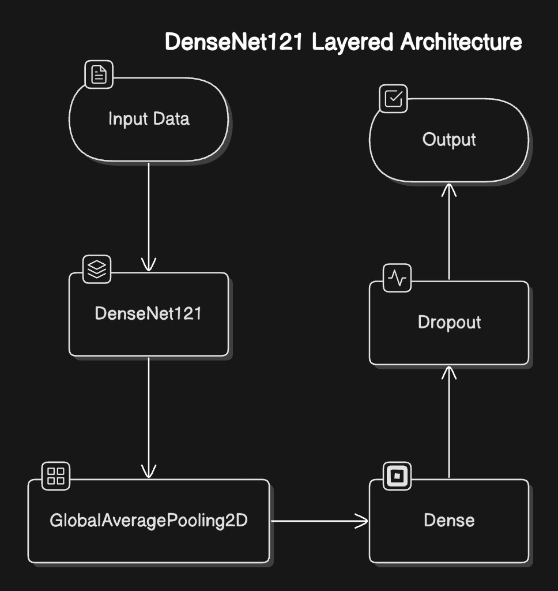
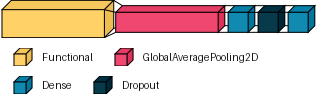

### 3.6 Training Configuration

* Loss: Categorical Cross-Entropy
* Optimizer: Adam
* Learning rate: 0.001 (with scheduler)
* Epochs: 20
* Batch size: 32
* Early stopping enabled

---

## 4. Results and Analysis

### 4.1 Metrics Used

* Accuracy
* Loss
* Precision
* Recall
* F1-Score

### 4.2 Initial Performance

| Model       | Accuracy | Loss | Precision | Recall | F1-score |
| ----------- | -------- | ---- | --------- | ------ | -------- |
| CNN I       | 80%      | 0.65 | 0.85      | 0.86   | 0.85     |
| CNN II      | 96%      | 0.12 | 0.97      | 0.98   | 0.98     |
| MobileNetV2 | 94%      | 0.18 | 0.95      | 0.95   | 0.95     |
| ResNet50    | 70%      | 1.04 | 0.13      | 0.33   | 0.19     |
| DenseNet121 | 95%      | 0.14 | 0.96      | 0.96   | 0.96     |

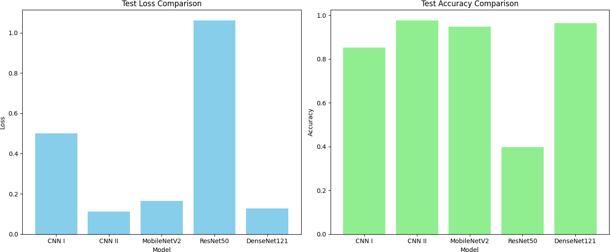

### 4.3 Fine-Tuning Results

| Model       | Accuracy | Loss | Precision | Recall | F1-score |
| ----------- | -------- | ---- | --------- | ------ | -------- |
| CNN I       | 88%      | 0.33 | 0.89      | 0.88   | 0.88     |
| CNN II      | 96%      | 0.12 | 0.97      | 0.98   | 0.98     |
| MobileNetV2 | 94%      | 0.18 | 0.95      | 0.95   | 0.95     |
| ResNet50    | 70%      | 1.04 | 0.13      | 0.33   | 0.19     |
| DenseNet121 | 95%      | 0.14 | 0.96      | 0.96   | 0.96     |

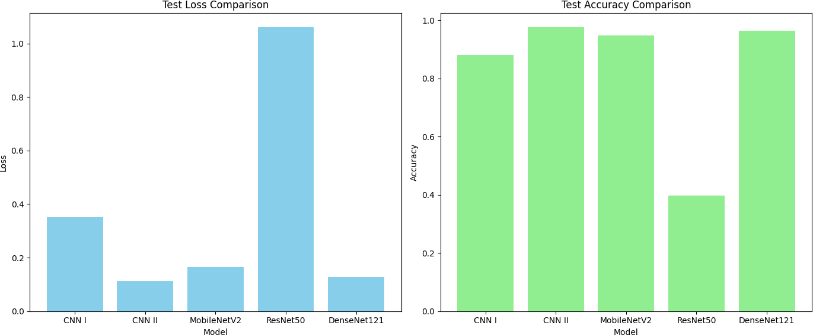

---

## 5. Comparative Summary

| Model       | Architecture      | Strengths                  | Weaknesses                |
| ----------- | ----------------- | -------------------------- | ------------------------- |
| MobileNetV2 | Lightweight       | Fast, efficient, robust    | Slightly lower accuracy   |
| ResNet50    | Deep (50 layers)  | Handles deep learning well | Struggles with small data |
| DenseNet121 | Dense connections | Reuses features, accurate  | More resource-intensive   |

---

## 6. Data Augmentation Experiment

| Subset     | Early Blight | Late Blight | Healthy   | Total     |
| ---------- | ------------ | ----------- | --------- | --------- |
| Training   | 11320        | 11320       | 11320     | 33960     |
| Validation | 1510         | 1510        | 1510      | 4530      |
| Testing    | 1410         | 1410        | 1410      | 4230      |
| **Total**  | **14240**    | **14240**   | **14240** | **42720** |

Dataset size post-augmentation: \~1.5 GB
